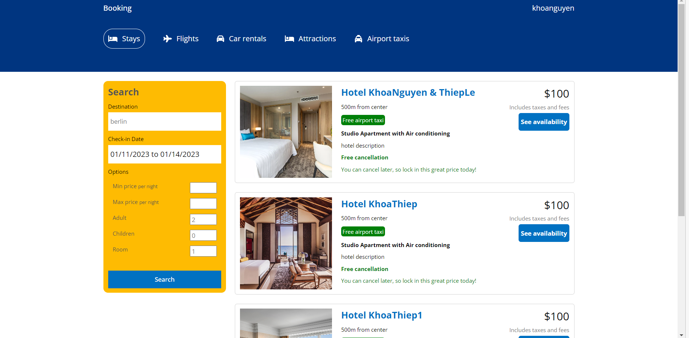
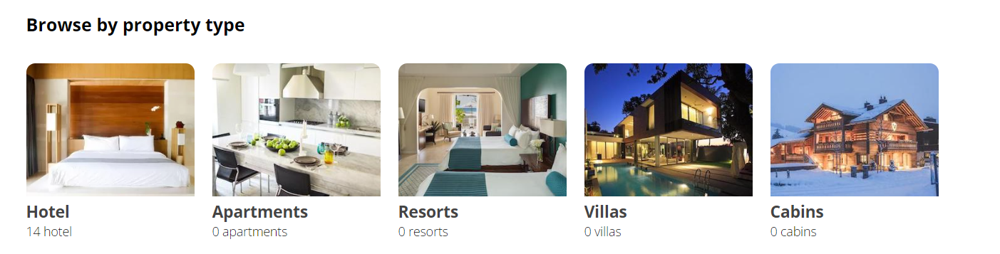
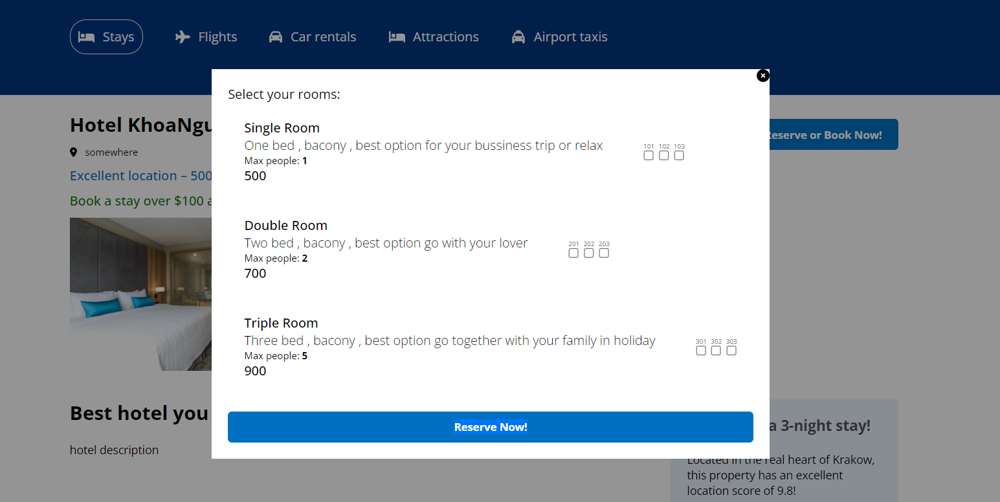
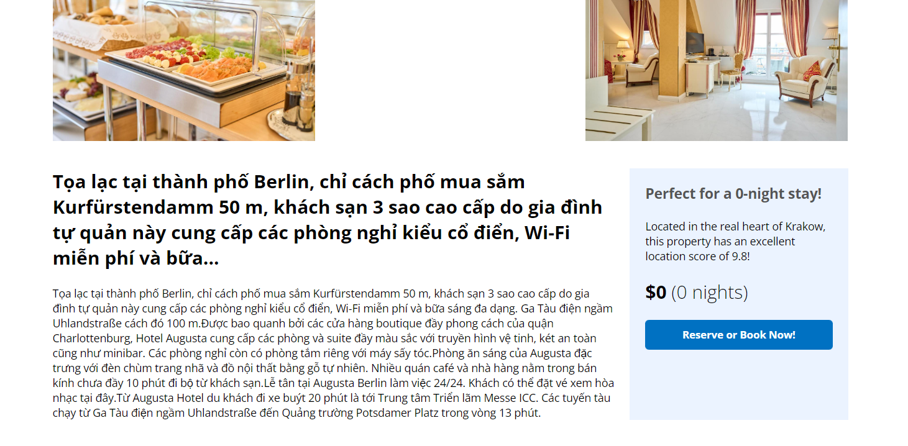
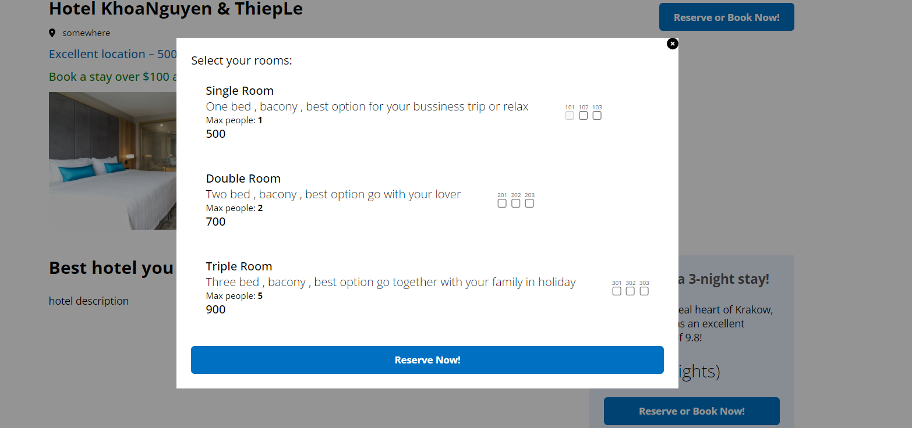
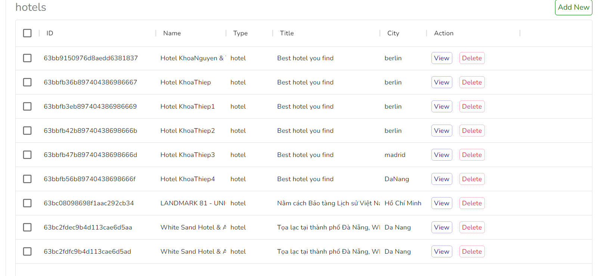
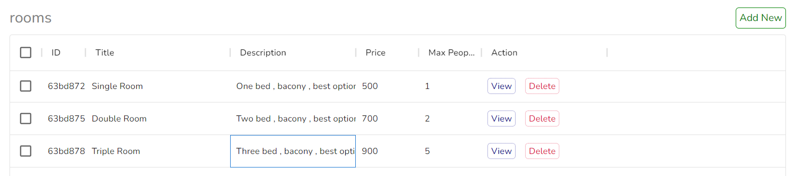

# Booking Hotel
Main feature of this project is can find hotel around the world and can reservation.


## Detail
- Total time taken: ~40
- Start date: 12/12
- Members: Nguyễn Hoàng Khoa - UIT (20521471)
- Framework: React , Express
- Libs: Axios
- Database: MongoDB
- I'm use Insomnia to make API request
-JWT,MUI,Cloudinary

## Feature

- Find hotel to reservation: You can search for hotels by the name of the country, select the check-in and check-out dates and the number of guests and rooms booked
  
  
- Browse by property type
- 
- Login to reservation room
- 
- 
- See detail of hotel 
- 
- 
- If someone has already booked a room, the room will no longer be available for booking
- 
- Admin page : can add hotel , add user, add room in hotel 
- 
- 


## Build Notes
```
# Clone project 
git clone https://github.com/khoanguyen23/Booking-Hotel.git
# Install dependencies
cd api
yarn
cd clien
yarn
cd admin
yarn
# Run
yarn start
